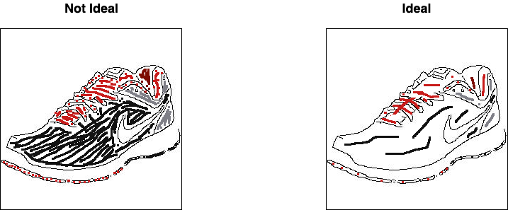
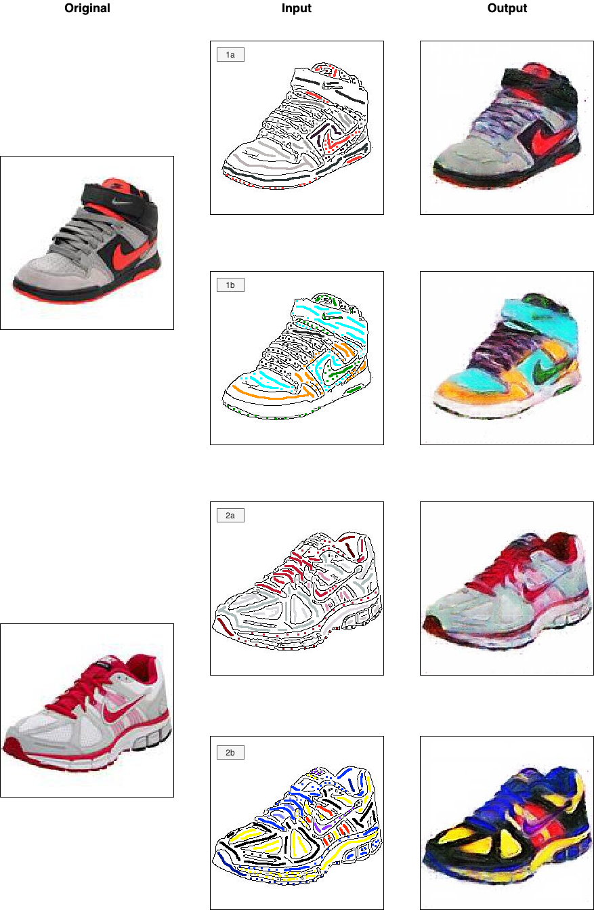

# pix2pix-edges-with-color

 
In the original implementation, the input image is black and white, only containing the edges of the shoe. After the GAN model is trained, there is no way to control the color of the output image.

In this project, color is added to the input image during training. Resulting in a generator model where the color in the output image corresponds to the color in the input image.

## Demo

## Training Data

Only the `Sneakers and Athletic Shoes` images from the [UT Zappos50K](http://vision.cs.utexas.edu/projects/finegrained/utzap50k/) dataset were used, resulting in 12,860 training examples. All images were resized from 136x136 to 256x256.

Canny edge detection was used to extract the edges of the shoes. The edges are 1 pixel in width.

350 points were randomly sampled from all non-white pixels in the original image. For each point, the RGB values of the surrounding pixels are averaged, resulting in a 3x3 pixels square. The 350 color points are overlayed onto the black and white edges image. The random sampling is done on-the-fly during the training phase, i.e., a new random sample is taken on every image for every epoch.

## Model Training

### Pix2Pix GAN Model

Jason Brownlee's [Keras implementation](https://machinelearningmastery.com/how-to-develop-a-pix2pix-gan-for-image-to-image-translation/) of the Pix2Pix GAN was used.

### Number of Color Points

Choosing the number of color points to randomly sample for the input image had a large impact on how the generated output image would look.

If the number of points is too small, there will be much more white space in the input image. Resulting in a model that is more likely to produce color in the output image in regions that were meant to be white. This is not ideal. If the toe cap of a shoe is white in the input, it should remain white in the output.

If the number of points is too large, the validation/test input images will also require a large number of color points/lines in the input, or the output will have a lot of white patches. Ultimately, the user will manually draw the black shoe edges and add color points/lines. The user experience would not be great if the user is forced to fill in large regions with color. Ideally, the user would only have to add a few color points/lines to each region and the model will know to fill in the entire region with that color.

### Model Training

The GAN model was trained for 30 epochs. After every epoch, the generator model generates a set of images and saves them to disk. Upon training completion, I inspected the saved images and the images from epoch 19 looked the best. The GAN model from epoch 19 was kept as the final model.

## Results

The color schemes for inputs `1a` and `2a` matches the original and were used during training. The color schemes for inputs `1b` and `2b` were chosen by me and were not used during training for those particular shoe models.

## Getting Started

First clone this repo. Then pip install the following python packages: tensorflow, keras, pillow, opencv-python, matplotlib.

### Retrain GAN Model

Open the [train_gan Notebook](https://github.com/michaelnation26/pix2pix-edges-with-color/blob/master/train_gan.ipynb). Besides pip installing the necessary python packages, there is no other setup steps needed. The Notebook will automatically download the training set for you. Go ahead and run the Notebook. Using a GPU is highly recommended.

### Using the Model

For generating images with the trained model, using a CPU is fine since the model is only generating one image at a time.

Open the [test_gan Notebook](https://github.com/michaelnation26/pix2pix-edges-with-color/blob/master/test_gan.ipynb). The Notebook will automatically download the trained generator model. There are some templates in the images folder you can use to get started. If you're using Mac, Paintbrush is an easy to use application to draw and color your input images. Make sure the black edges are 1px in width and the colors are 3px in width. For Paintbrush, the stroke sizes are 1 and 2 respectively.

---

The original implementation and data credits go to their respective authors. This information is presented here for personal understanding and educational purposes.
